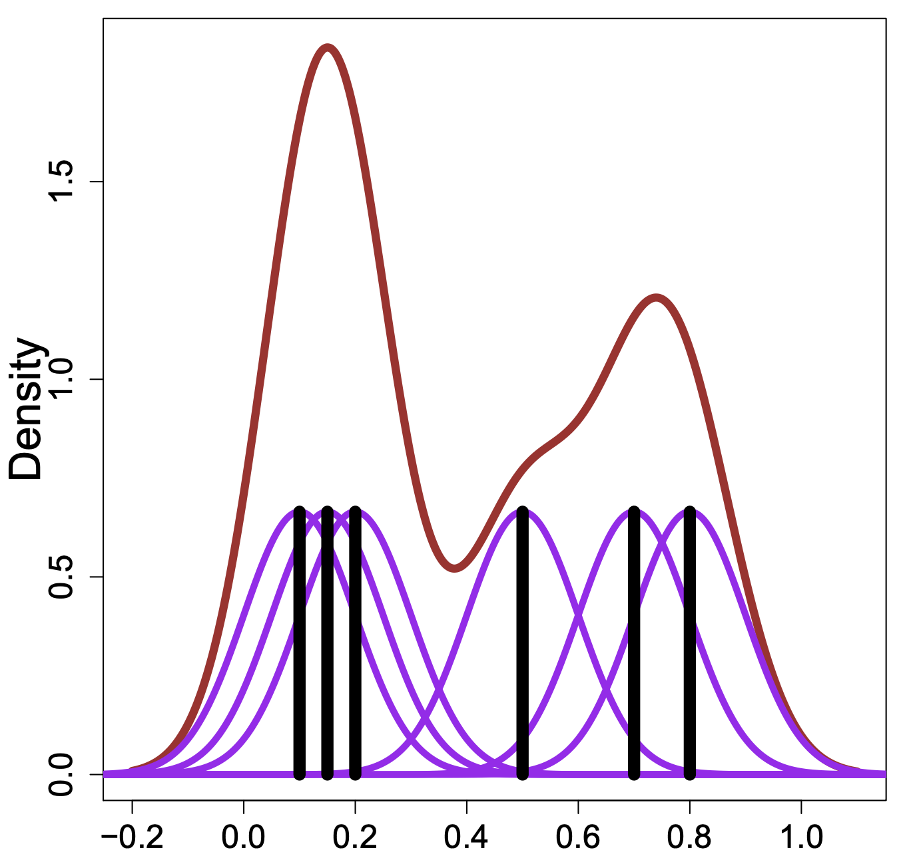

```{r}
#| include: false
knitr::opts_chunk$set(
  echo = TRUE,
  message = FALSE,
  warning = FALSE,
  fig.align = "center"
)
ggplot2::theme_set(ggplot2::theme_gray(base_size = 20))
```

## Quantitative data

Two different versions of quantitative data:

**Discrete**: countable and has clear space between values (i.e. whole number only)

* Examples: number of goals scored in a soccer game, number of children in a family,...

**Continuous**: can take any value within some interval

* Examples: price of houses in Pittsburgh, water temperature, wind speed,...

## Summarizing 1D quantitative data

* Center: mean, median, number and location of modes

  * Related to the first moment, i.e., $E(X)$

. . .

* Spread: range, variance, standard deviation, IQR, etc.

  * Related to the second moment, i.e., $E(X^2)$

. . .

* Shape: symmetry, skew, kurtosis ("peakedness")

  * Related to higher-order moments, i.e., skewness is $E(X^3)$, kurtosis is $E(X^4)$

. . .

Compute various statistics in `R` with `summary()`, `mean()`, `median()`, `quantile()`, `range()`, `sd()`, `var()`, etc.

. . .

Example: Summarizing flipper length of penguins

```{r}
summary(penguins$flipper_len)
sd(penguins$flipper_len, na.rm = TRUE)
```

```{r}
#| echo: false
library(tidyverse)
```


## Boxplots visualize summary statistics

::: columns
::: {.column}

Pros:

* Displays outliers, percentiles, spread, skew

* Useful for side-by-side comparison

Cons:

* Does not display the full distribution shape

* Does not display modes

[The expert weighed in...](https://twitter.com/CMUAnalytics/status/1111695744271114241)

:::

::: {.column}
```{r}
#| fig-height: 4
penguins |> 
  ggplot(aes(x = flipper_len)) +
  geom_boxplot() +
  theme(axis.text.y = element_blank())
```
:::
:::

## Do NOT rely on box plots

Another example of [**same stats, different graphs**](https://www.research.autodesk.com/publications/same-stats-different-graphs/)

<br>

{width=1550}


<br>

Three clearly different distributions of data, but all result in the exact same box plot!

## Histograms display 1D continuous distributions

::: columns
::: {.column}

$\displaystyle \text{# total obs.} = \sum_{j=1}^k \text{# obs. in bin }j$

Pros:

* Displays full shape of distribution

* Easy to interpret

Cons:

* Have to choose number of bins and bin locations (more on this later)

:::

::: {.column}

```{r}
#| fig-height: 9
penguins |> 
  ggplot(aes(x = flipper_len)) +
  geom_histogram()
```

:::
:::

## Display the data points directly with beeswarm plots

::: columns
::: {.column}

Pros:

* Displays each data point

* Easy to view full shape of distribution

Cons:

* Can be overbearing with large datasets

* Which algorithm for arranging points?

:::

::: {.column}

```{r}
library(ggbeeswarm)
penguins |> 
  ggplot(aes(x = flipper_len, y = "")) +
  geom_beeswarm(cex = 2)
```

:::
:::

## Smooth summary with violin plots

::: columns
::: {.column}

Pros:

* Displays full shape of distribution

* Can easily layer...

:::

::: {.column}

```{r}
penguins |> 
  ggplot(aes(x = flipper_len, y = "")) +
  geom_violin()
```

:::
:::


## Smooth summary with violin plots + box plots


::: columns
::: {.column}

Pros:

* Displays full shape of distribution

* Can easily layer... with box plots on top

Cons:

* Summary of data via density estimate

* Mirror image is duplicate information


:::

::: {.column}

```{r}
penguins |> 
  ggplot(aes(x = flipper_len, y = "")) +
  geom_violin() +
  geom_boxplot(width = 0.2)
```

:::
:::

## What do visualizations of continuous distributions display?

* Probability that continuous variable $X$ takes a particular value is 0

  * e.g. $P($ `flipper_len` $= 200) = 0$ (why?)
  
. . .

* For continuous variables, the cumulative distribution function (CDF) is $$F(x) = P(X \leq x)$$

. . .

* For $n$ observations, the empirical CDF (ECDF) can be computed based on the observed data $$\hat{F}_n(x)  = \frac{\text{# obs. with variable} \leq x}{n} = \frac{1}{n} \sum_{i=1}^{n} I (x_i \leq x)$$ where $I()$ is the indicator function

## Display full distribution with ECDF plots

::: columns
::: {.column}


Pros:

* Displays all of the data (sorted)

* Does NOT require any parameters to adjust

* As $n \rightarrow \infty$, the ECDF $\hat F_n(x)$ converges to<br>the true CDF $F(x)$

Cons:

* What are the cons?


:::


::: {.column}

```{r}
#| fig-height: 9
penguins |> 
  ggplot(aes(x = flipper_len)) +
  stat_ecdf()
```

:::
:::


## Rug plots display raw data

::: columns
::: {.column}

Pros:

* Displays raw data points

* Useful supplement for summaries and 2D plots

Cons:

* Can be overbearing for large datasets


:::

::: {.column}


```{r}
#| fig-height: 9
penguins |> 
  ggplot(aes(x = flipper_len)) +
  geom_rug(alpha = 0.5)
```

:::
:::

## Rug plots supplement other displays

::: columns
::: {.column}

```{r}
#| fig-height: 9
penguins |> 
  ggplot(aes(x = flipper_len)) +
  geom_histogram() +
  geom_rug(alpha = 0.5)
```

:::


::: {.column}

```{r}
#| fig-height: 9
penguins |> 
  ggplot(aes(x = flipper_len)) +
  stat_ecdf() +
  geom_rug(alpha = 0.5)
```

:::
:::

## Revisiting histograms

```{r}
#| label: flipper-len-hist
#| eval: false
penguins |>
  ggplot(aes(x = flipper_len)) +
  geom_histogram()
```

::: columns
::: {.column}

* Split observed data into **bins**

* **Count** number of observations in each bin

**Need to choose the number of bins**, adjust with:

* `bins`: number of bins (default is 30)

* `binwidth`: width of bins (overrides `bins`),<br>various [rules of thumb](https://en.wikipedia.org/wiki/Histogram)

* `breaks`: vector of bin boundaries (overrides both `bins` and `binwidth`)
:::

::: {.column}
```{r}
#| ref-label: "flipper-len-hist"
#| fig-height: 9
#| echo: false
```
:::
:::

## Adjusting the binwidth

::: columns
::: {.column}
**Small** `binwidth` $\rightarrow$ undersmooth/spiky

```{r}
#| label: flipper-len-hist-small
#| fig-height: 8
penguins |>
  ggplot(aes(x = flipper_len)) +
  geom_histogram(binwidth = 0.5)
```
:::

::: {.column}
**Large** `binwidth` $\rightarrow$ oversmooth/flat

```{r}
#| label: flipper-len-hist-large
#| fig-height: 8
penguins |>
  ggplot(aes(x = flipper_len)) +
  geom_histogram(binwidth = 5)
```
:::
:::

## Adjusting the binwidth

* A binwidth that is too narrow shows too much detail

  * too many bins: low bias, high variance
    
. . .

* A binwidth that is too wide hides detail

  * too few bins: high bias, low variance
    
. . .    

* Always pick a value that is "just right" ([The Goldilocks principle](https://en.wikipedia.org/wiki/Goldilocks_principle), the "baby bear")

**Try several values, the `ggplot2` default is NOT guaranteed to be an optimal choice**

## How do histograms relate to the PDF & CDF?

* Histograms approximate the PDF with bins, and **points are equally likely within a bin**

* PDF is the **derivative** of the cumulative distribution function (CDF)

::: columns
::: {.column}
```{r}
#| label: flipper-len-hist-left
#| echo: false
#| fig-height: 7
penguins |>
  ggplot(aes(x = flipper_len)) + 
  geom_histogram() +
  geom_rug(alpha = 0.3)
```
:::

::: {.column}
```{r}
#| label: flipper-len-ecdf-right
#| echo: false
#| fig-height: 7
penguins |>
  ggplot(aes(x = flipper_len)) + 
  stat_ecdf() +
  geom_rug(alpha = 0.3)
```
:::
:::
    
## Kernel density estimation: intuition
    
*  Smooth each data point into a small density bumps
*  Sum all these small bumps together to obtain the final density estimate

Check out this great [interactive tutorial](https://mathisonian.github.io/kde/)

<center>
{height=550}
</center>

## Kernel density estimation (KDE)

**Goal**: estimate the PDF $f(x)$ for all possible values (assuming it is smooth)

. . .

The kernel density estimator (KDE) is $\displaystyle \hat{f}(x) = \frac{1}{n} \sum_{i=1}^n \frac{1}{h} K_h(x - x_i)$

. . .

* $n$: sample size

* $x$: new point to estimate $f(x)$ (does NOT have to be in the dataset!)

* $h$: **bandwidth**, analogous to histogram binwidth, ensures $\hat{f}(x)$ integrates to 1

* $x_i$: $i$th observation in the dataset

. . .

* $K_h(x - x_i)$: **kernel** function, creates **weight** given distance of $i$th observation from new point

    * as $|x - x_i| \rightarrow \infty$ then $K_h(x - x_i) \rightarrow 0$<br>(i.e. the further apart the $i$th observation is from $x$, the smaller the weight)

    * as **bandwidth** $h$ increases, weights are more evenly spread out

    * $K_h(x - x_i)$ is large when $x_i$ is close to $x$
    
## Choice of kernel

The Gaussian (normal) kernel is typically used, but there are many other choices

<center>
{height=600}
</center>

## Visualizing KDE

::: columns
::: {.column}

```{r}
#| label: curve
#| eval: false 
penguins |>
  ggplot(aes(x = flipper_len)) + 
  geom_density() +
  geom_rug(alpha = 0.3)
```

Pros:

* Displays full shape of distribution

* Can easily layer

* Add categorical variable with color

Cons:

* Need to pick bandwidth and kernel...
:::

::: {.column}
```{r}
#| ref-label: "curve"
#| fig-height: 9
#| echo: false
```
:::
:::

## What about the bandwidth?

See `help(geom_density)` for the default bandwidth

Modify the bandwidth using the `adjust` argument (value to multiply default bandwidth by)

::: columns
::: {.column}
```{r}
#| fig-height: 7
penguins |>
  ggplot(aes(x = flipper_len)) + 
  geom_density(adjust = 0.2) +
  geom_rug(alpha = 0.3)
```
:::

::: {.column}
```{r}
#| fig-height: 7
penguins |>
  ggplot(aes(x = flipper_len)) + 
  geom_density(adjust = 2) +
  geom_rug(alpha = 0.3)
```
:::
:::

## Notes on KDE

* In KDE, the bandwidth parameter is analogous to the binwidth in histograms

  * Too small bandwidth: density estimate can become overly peaky, main trends in the data may be obscured

  * Too large bandwidth: features in the distribution of the data may disappear
  
  * Always pick a value that is "just right"

. . .

* The choice of the kernel can affect the shape of the density curve.

  * A Gaussian kernel typically gives density estimates that look bell-shaped (ish)

  * A rectangular kernel can generate the appearance of steps in the density curve  

  * Kernel choice matters less with more data points
  
. . .
    
**Density plots are often reliable and informative for large datasets but can be misleading for smaller ones.**

## Conditional distributions: quantitative by categorical

::: columns
::: {.column width="40%"}

```{r}
#| label: histogram-stack
#| eval: false
penguins |> 
  ggplot(aes(x = flipper_len)) + 
  geom_histogram(aes(fill = species))
```

* Display conditional distribution of<br>`flipper_len` | `species` (i.e., `x` | `fill`)
  
* Default behavior is to **stack** histograms
  
* **Which distribution is easy to see here?**

:::
::: {.column width="60%"}

```{r}
#| ref-label: "histogram-stack"
#| echo: false
#| fig-height: 7
```
:::
:::

## Conditional distributions: quantitative by categorical

::: columns
::: {.column width="40%"}

```{r}
#| label: histogram-identity
#| eval: false
penguins |> 
  ggplot(aes(x = flipper_len)) +
  geom_histogram(aes(fill = species),
                 position = "identity", alpha = 0.3)
```

* Can change to overlay histograms

* Specify `position = identity`

* Adjust transparency with `alpha`

:::
::: {.column width="60%"}
```{r}
#| ref-label: "histogram-identity"
#| echo: false
#| fig-height: 7
```
:::
:::

## Normalize histogram frequencies with density

::: columns
::: {.column width="40%"}

```{r}
#| label: histogram-density
#| eval: false
penguins |> 
  ggplot(aes(x = flipper_len)) +
  geom_histogram(aes(fill = species,
                     y = after_stat(density)),
                 position = "identity", alpha = 0.3)
```

* Total area under the bars equals to 1

* Area of any bar:<br>height $\times$ width $=$ density $\times$ width

:::
::: {.column width="60%"}
```{r}
#| ref-label: "histogram-density"
#| echo: false
#| fig-height: 7
```
:::
:::

## Density curves for comparison

::: columns
::: {.column width="40%"}

```{r}
#| label: density-curves
#| eval: false
penguins |> 
  ggplot(aes(x = flipper_len)) +
  geom_density(aes(color = species), linewidth = 1.5)
```

* The density curves should NOT be filled

:::
::: {.column width="60%"}
```{r}
#| ref-label: "density-curves"
#| echo: false
#| fig-height: 7
```
:::
:::

## ECDF curves for comparison

::: columns
::: {.column width="40%"}

```{r}
#| label: ecdf-curves
#| eval: false
penguins |> 
  ggplot(aes(x = flipper_len)) +
  stat_ecdf(aes(color = species), linewidth = 1.5)
```

:::
::: {.column width="60%"}
```{r}
#| ref-label: "ecdf-curves"
#| echo: false
#| fig-height: 7
```
:::
:::

## Side-by-side plots for comparing groups

::: columns
::: {.column width="40%"}

Side-by-side box plots can be useful...

```{r}
#| label: side-boxplot
#| eval: false
penguins |> 
  ggplot(aes(x = flipper_len)) + 
  geom_boxplot(aes(y = species))
```

Pros:

* Visualize conditional distribution

Cons:

* Still a boxplot...
  
:::
::: {.column width="60%"}
```{r} 
#| ref-label: "side-boxplot" 
#| echo: false
#| fig-height: 7
```

:::
:::

## Side-by-side plots for comparing groups

::: columns
::: {.column width="40%"}

* Map a variable to `fill`

* Add a third dimension to plot

* Condition on 2 categorical variables (`species` and `sex`)

```{r}
#| label: side-boxplot-fill
#| eval: false
penguins |> 
  filter(!is.na(sex)) |> 
  ggplot(aes(x = flipper_len)) + 
  geom_boxplot(aes(y = species, fill = sex))
```


  
:::
::: {.column width="60%"}
```{r} 
#| ref-label: "side-boxplot-fill" 
#| echo: false
#| fig-height: 7
```

:::
:::

## Side-by-side plots for comparing groups

::: columns
::: {.column width="40%"}

* Side-by-side box plots + violin plots

```{r}
#| label: side-boxplot-violin
#| eval: false
penguins |> 
  ggplot(aes(x = flipper_len, y = species)) +
  geom_violin() +
  geom_boxplot(width = 0.2)
```


  
:::
::: {.column width="60%"}
```{r} 
#| ref-label: "side-boxplot-violin" 
#| echo: false
#| fig-height: 7
```

:::
:::

## Ridgeline plots (joyplots)

::: columns
::: {.column width="40%"}

* Check out the [`ggridges`](https://cran.r-project.org/web/packages/ggridges/vignettes/introduction.html) package for a variety of customization options

* Useful for displaying conditional distributions across many levels

```{r}
#| label: ridges
#| eval: false
library(ggridges)
penguins |> 
  ggplot(aes(x = flipper_len, y = species)) +
  geom_density_ridges(scale = 1)
```
  
:::
::: {.column width="60%"}
```{r} 
#| ref-label: "ridges" 
#| echo: false
#| fig-height: 7
```

:::
:::